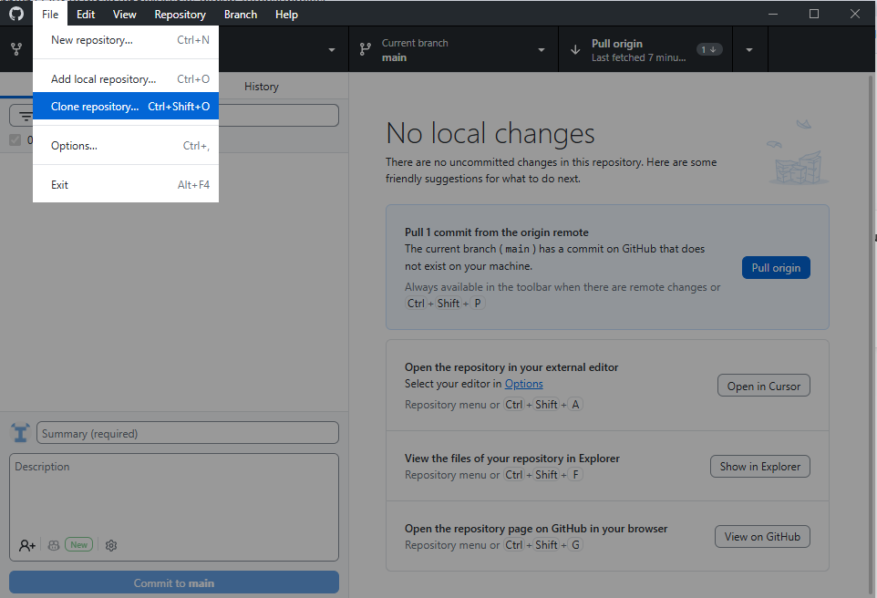
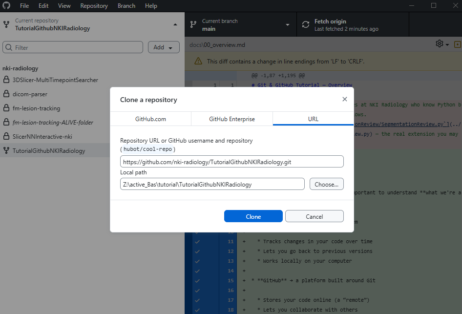

# Git & GitHub Tutorial — Overview

---

## 1. What are Git and GitHub?

Before installing anything, it's important to understand **what we're actually using**:

* **Git** → a version control system

  * Tracks changes in your code over time
  * Lets you go back to previous versions
  * Works locally on your computer

* **GitHub** → a platform built around Git

  * Stores your code online (a “remote”)
  * Lets you collaborate with others
  * Adds tools like Pull Requests and code review

👉 In simple terms:

* Git = the engine
* GitHub = the collaboration platform

---

## 2. Installing the tools

First, install Git:

* Download here: [https://git-scm.com/install](https://git-scm.com/install)

Git works via a **terminal** (Command Prompt / PowerShell on Windows).

If you are not comfortable with terminals, you can use a graphical interface (GUI):

* GUI clients: [https://git-scm.com/tools/guis](https://git-scm.com/tools/guis)

👉 **Recommended for this tutorial:**

* **GitHub Desktop** (easy to use, we will reference it in examples)

---

## 3. What is a repository?

A **repository (repo)** is simply:

> A folder that contains your code **plus its full history**

It tracks:

* All changes ever made
* Who made them
* When they were made

You can have:

* A **local repo** → on your computer
* A **remote repo** → on GitHub

---

## 4. Getting the tutorial code (clone)

To start working, you need a copy of the repository on your computer. This is called **cloning**.

On the GitHub page:

* Click the green `<> Code` button
* Copy the repository URL

### Option A — Using terminal

```bash
git clone https://github.com/nki-radiology/TutorialGithubNKIRadiology.git
cd TutorialGithubNKIRadiology
git status
```

### Option B — Using GitHub Desktop (recommended)

* Click **File → Clone repository**
* Paste the repository URL
* Choose a location on your computer

<p align="center">
  
  
</p>

---

## 5. What you will learn

This tutorial is structured into modules:

| # | Topic                                          | File                       |
| - | ---------------------------------------------- | -------------------------- |
| 0 | **Overview** (this page)                       | `00_overview.md`           |
| 1 | **Core concepts** — repo, commit, staging area | `01_core_concepts.md`      |
| 2 | **Branches** — create, switch, merge           | `02_branches.md`           |
| 3 | **Remote workflow** — clone, fetch, pull, push | `03_remote_workflow.md`    |
| 4 | **Commit conventions** — writing clear commits | `04_commit_conventions.md` |
| 5 | **Pull Requests** — collaboration workflow     | `05_pull_requests.md`      |
| 6 | **Rebase** — clean history & conflict handling | `06_rebase.md`             |
| 7 | **CI / GitHub Actions** — automated checks     | `07_ci_github_actions.md`  |
| 8 | **Exercises** — hands-on practice              | `08_exercises.md`          |

---

## Next step

Continue to:
👉 **[01_core_concepts.md](01_core_concepts.md)**
