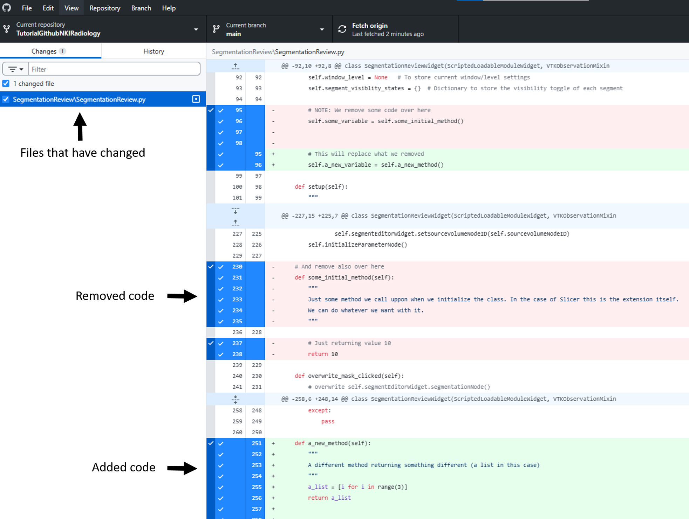
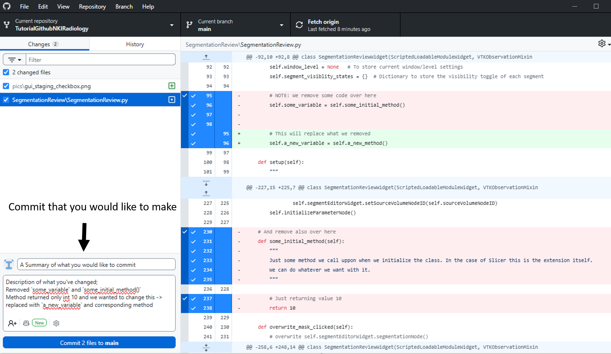
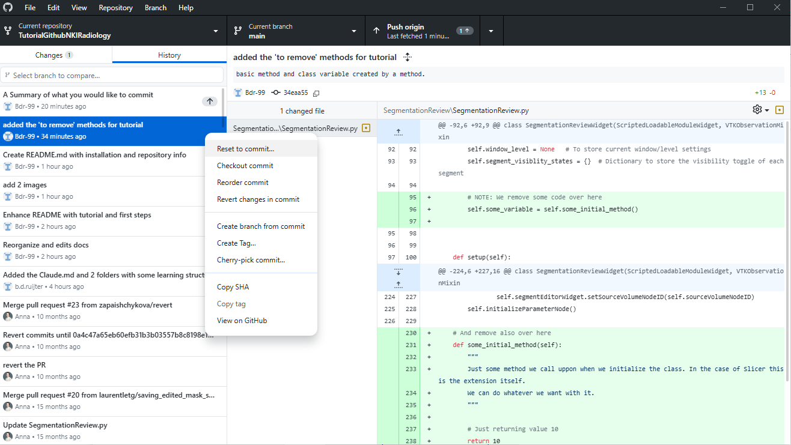

# 01 — Core concepts

In this section, we explain the **fundamental building blocks of Git**.

Do not worry about memorizing commands — focus on understanding *what is happening*.

---

## 1. How Git stores changes

Git works with **three separate areas**:

```text
Working directory → Staging area → Repository
```

These are the three places your work moves through when using Git.

---

### 1. Working directory

This is simply:

> The files on your computer

* You edit code here
* Changes start here
* Nothing is saved to Git yet

👉 Example: you modify `SegmentationReview.py`

---

### What you see in GitHub Desktop

After editing a file, GitHub Desktop will show:

* The file under **Changes**
* A visual **diff** showing what changed

<p align="center">
  
</p>

👉 Interpretation:

* Green = added lines
* Red = removed lines
* These changes are still only on your computer

---

### 2. Staging area

This is the **selection step**.

> You choose which changes should be included in the next commit

In Git, changes do not go directly from editing to saved history.
First, you select what should be included.

In the terminal, this is done with:

```bash
git add <file>
```

---

### What you see in GitHub Desktop

GitHub Desktop shows this selection visually:

* Each changed file has a **checkbox**
* Checked = included in the next commit
* Unchecked = not included yet

👉 Important:

* Git does **not** automatically include everything
* You stay in control of what gets saved

---

### 3. Repository

This is where Git stores history.

> The repository contains the saved history of your project

That history is built from **commits**.

---

### What is a commit?

A **commit** is a saved snapshot of the selected changes.

You can think of it as:

> “This is a version of the project I want Git to remember”

In the terminal, a commit is created with:

```bash
git commit -m "Describe what changed"
```

---

### What you see in GitHub Desktop

At the bottom of the window, GitHub Desktop shows:

* A **text field** for the commit message
* A **Commit** button

<p align="center">
  
</p>

After a commit:

* The selected changes are saved into Git history
* They disappear from the **Changes** tab
* The project now has a new saved version **Locally**

Each commit also gets a unique ID, called a **SHA**.
This allows Git to refer exactly to a specific saved version.

---

## 2. Visual overview

```text
[ Edit files ]
      ↓
[ Select changes ]
      ↓
[ Save snapshot ]
```

Or in Git terms:

```text
Working directory → Staging area → Repository
```

---

## 3. Why Git works this way

This structure may feel unnecessary at first, but it gives you three important benefits.

### Control

You decide exactly what goes into a saved version

### Clarity

Each commit can represent one logical change

### Safety

Git keeps a history, so earlier versions are not lost

## 4. Going back to previous versions

One of the biggest advantages of Git is that you can **go back in time**.

Because every commit is a saved snapshot:

* You can return to a previous version of your code
* You can undo changes from the most recent commit
* You can compare different versions of your work

👉 In practice, this means:

* If you make a mistake → you can **reverse the changes**
* If something breaks → you can **go back to a working version**
* If you want to inspect old code → you can **open any previous commit**

This is a key reason why Git uses commits:
each commit acts as a **safe restore point**.

<p align="center">
  
</p>


---

## 5. Key concept to remember

> Git does **not automatically save your work**

Changing a file is not the same as saving it in Git.

Your work only becomes part of Git history after it is:

1. Selected
2. Committed

---

## 6. Common beginner misunderstandings

### “I changed a file, so Git saved it”

No — editing a file only changes the working directory

---

### “Everything I changed will automatically be included”

No — Git uses a staging step, so you choose what is included

---

### “A commit is the same as pressing save in an editor”

Not quite — saving in your editor stores the file on disk, while a commit stores a version in Git history

---

## 7. Terminology summary

| Term              | Meaning                                  |
| ----------------- | ---------------------------------------- |
| Working directory | Your files on disk                       |
| Staging area      | The selected changes for the next commit |
| Commit            | A saved snapshot of selected changes     |
| Repository        | The full history stored by Git           |
| SHA               | The unique ID of a commit                |

---

## Next step

Now that the core ideas are clear, continue to:

👉 **[02_branches.md](02_branches.md)**